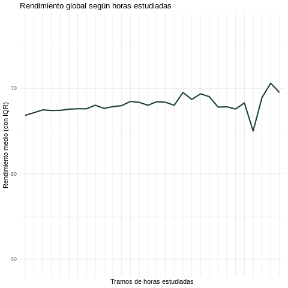
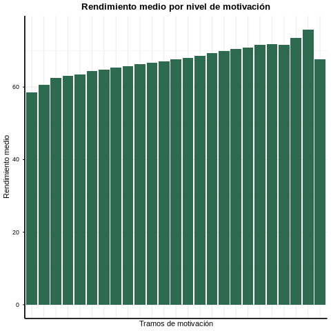

📘 Análisis Exploratorio de Datos (EDA) en R — Student Course Completion Dataset

Este proyecto realiza un Análisis Exploratorio de Datos (EDA) completo utilizando R dentro de Google Colab, basado en el dataset:

📊 Student Course Completion Prediction Dataset
Fuente: Kaggle

El objetivo principal es comprender los factores que influyen en si un estudiante completa o no un curso online, analizar patrones de comportamiento y generar nuevas características relevantes para futuros modelos predictivos.

📂 Estructura del Proyecto
├── trabajo_bigdata_R.ipynb   # Notebook principal con el análisis en R
├── README.md                 # Este archivo

🎯 Objetivos del Proyecto

Importar y preparar el dataset en R utilizando Google Colab.

Realizar un EDA detallado:

Revisar estructura, tipos de datos y valores faltantes.

Calcular estadísticas descriptivas.

Crear nuevas características (feature engineering) basadas en comportamiento del estudiante.

Visualizar relaciones relevantes mediante gráficos.

Interpretar patrones que puedan ayudar en tareas de predicción de finalización del curso.

🧬 Dataset

El dataset contiene 100.000 observaciones y 40 variables, incluyendo información sobre:

Datos personales (edad, género, ciudad…)

Información de cursos

Actividad en la plataforma

Interacción, motivación y rendimiento

Métricas de estudio

Variable objetivo: Completed / Not Completed

Durante el EDA se crearon nuevas columnas útiles para el análisis, como:

Hours_Studied

Attendance_Rate

Motivation_Score

Overall_Performance

🛠️ Instalación y ejecución en Google Colab

Este proyecto utiliza R en Colab, por lo que no se requiere instalación local.

Para ejecutar el notebook:

Abre Google Colab

Sube el archivo trabajo_bigdata_R.ipynb

Asegúrate de seleccionar lenguaje R usando:

%load_ext rpy2.ipython

Ejecuta las celdas en orden

🔍 1. Exploración Inicial (EDA)

La primera parte del análisis consiste en:

Vista general del dataset con str(df) y head()

Revisión de valores faltantes

Estadísticos con summary()

Distribuciones de variables clave

Detección de potenciales outliers

🧪 2. Feature Engineering

Se crearon nuevas columnas a partir de las existentes:

✔️ Hours_Studied

Combina tiempo total invertido en la plataforma:

df$Hours_Studied <- df$Time_Spent_Hours + (df$Average_Session_Duration_Min / 60)

✔️ Attendance_Rate

Proporción de actividad respecto a días sin conectarse:

df$Attendance_Rate <- df$Login_Frequency / (df$Days_Since_Last_Login + 1)

✔️ Motivation_Score

Promedio entre participación y rewatch:

df$Motivation_Score <- df$Discussion_Participation + df$Rewatch_Count

✔️ Overall_Performance

Integra quizzes, proyectos y progreso:

df$Overall_Performance <- (df$Quiz_Score_Avg + df$Project_Grade + df$Progress_Percentage) / 3

Estas nuevas columnas permitieron visualizar de forma más clara el comportamiento del estudiante.

📊 3. Visualizaciones Incluidas

Se seleccionaron tres gráficas finales como resumen más representativo del análisis:

📍 Gráfica 1 — Hours_Studied vs Overall_Performance

📈 Relación entre horas estudiadas y rendimiento promedio.
Ayuda a identificar si estudiar más se asocia a mejores resultados.

📍 Gráfica 2 — Motivation Score por género

📦 Comparación de motivación entre géneros mediante boxplots.
Permite observar diferencias en compromiso según grupos.

📍 Gráfica 3 — Motivation Score vs Overall Performance

🔗 Gráfico de dispersión entre motivación y desempeño global.
Busca patrones sobre si estudiantes más motivados rinden mejor.

🧠 Conclusiones del Análisis

✔ Los estudiantes con mayor tiempo de estudio tienden a obtener mejores resultados.
✔ La motivación influye positivamente en el rendimiento global.
✔ Las diferencias por género en motivación son mínimas pero visibles en la mediana.
✔ Las nuevas características creadas ayudan a visualizar mejor los comportamientos.
✔ Se identificaron patrones útiles para construir un futuro modelo de predicción de finalización del curso.

📌 Requisitos del Proyecto

El notebook usa los siguientes paquetes de R:

library(ggplot2)
library(dplyr)
library(tidyr)
library(reshape2)

🚀 Próximos pasos

Entrenar un modelo para predecir si un estudiante completará el curso

Seleccionar features relevantes mediante técnicas estadísticas

Comparar modelos: regresión logística, random forest, XGBoost

👨‍💻 Autor

Sebastián Candelas Quero
